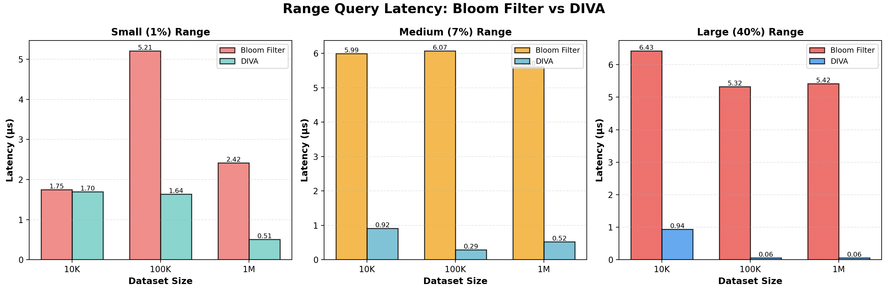
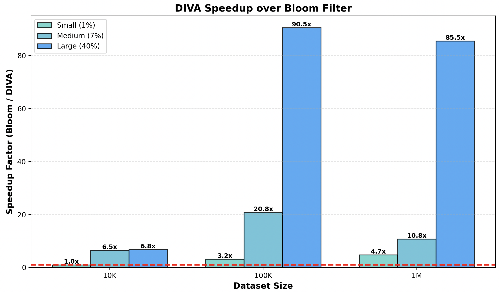

# Range Filters

High-performance dynamic range filter implementation in Rust, featuring [DIVA](https://dl.acm.org/doi/10.14778/3749646.3749664) - a state-of-the-art range filter that won the VLDB 2025 Best Research Paper Award.

## About DIVA

DIVA is a novel range filter data structure designed for efficient range queries on sorted data. Unlike traditional Bloom filters that are efficient only for point queries, DIVA provides native support for range queries while maintaining low memory overhead and high query performance.

Key features:
- **Fast range queries**: O(log log U) complexity for range lookups
- **Space efficient**: Uses adaptive sampling and quotient filter compression
- **Dynamic updates**: Supports insertions and deletions with probabilistic sampling
- **Distribution-aware**: Learns data distribution for optimal performance

## Installation

Add this to your `Cargo.toml`:

```toml
[dependencies]
range-filters = "0.1.0"
```

## Usage

### Creating a DIVA Range Filter

```rust
use range_filters::Diva;

// Create a DIVA filter from sorted keys
let keys = vec![100, 200, 300, 400, 500, 600, 700, 800, 900, 1000];
let target_size = 1024;  // Sample every 1024 keys
let fpr = 0.01;          // 1% false positive rate

let diva = Diva::new_with_keys(&keys, target_size, fpr);
```

### Range Queries

```rust
// Check if any key exists in the range [200, 600]
if diva.range_query(200, 600) {
    println!("At least one key exists in range [200, 600]");
}
```

### Dynamic Insertions

```rust
let mut diva = Diva::new_with_keys(&keys, 1024, 0.01);

// Insert a new key
diva.insert(550);

// Verify insertion
assert!(diva.contains(550));
```

## Running Benchmarks

The repository includes benchmarks comparing DIVA with Bloom filters. We compare it with fast-bloom implementation of Bloom Filter.

### Run all benchmarks

```bash
cargo bench
```

### Run specific benchmarks

```bash
# Run only DIVA benchmarks
cargo bench diva

# Run only range query benchmarks
cargo bench range_query

# Run construction benchmarks
cargo bench construction

# Run point query benchmarks
cargo bench point_query
```

### Benchmark parameters

- **Dataset sizes**: 10K, 100K, 1M keys
- **Range sizes**: Small (1%), Medium (7%), Large (40%)
- **Query types**: Point queries (50% hits, 50% misses), Range queries

## Benchmark Results

DIVA significantly outperforms traditional Bloom filters for range queries:

### Range Query Performance Comparison



### DIVA Speedup over Bloom Filter



### Key Findings

- **1-90x faster** than Bloom filters for range queries
- Performance advantage increases with dataset size
- **85-90x speedup** for large ranges on 1M+ keys
- Consistent low latency across different range sizes

## Architecture

DIVA combines several data structures for optimal performance:

- **Y-Fast Trie**: Stores sampled boundary keys with O(log log U) lookup
- **Binary Search Trees**: Organizes keys within sample buckets
- **InfixStore**: Quotient filter variant for compressed key storage
- **Adaptive Sampling**: Learns data distribution for efficient queries

## License

This project is licensed under the MIT License.

## Contributing

Contributions are welcome! Please feel free to submit issues or pull requests.
